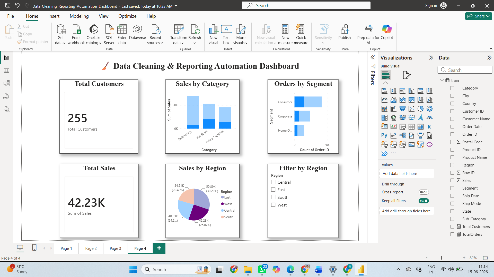
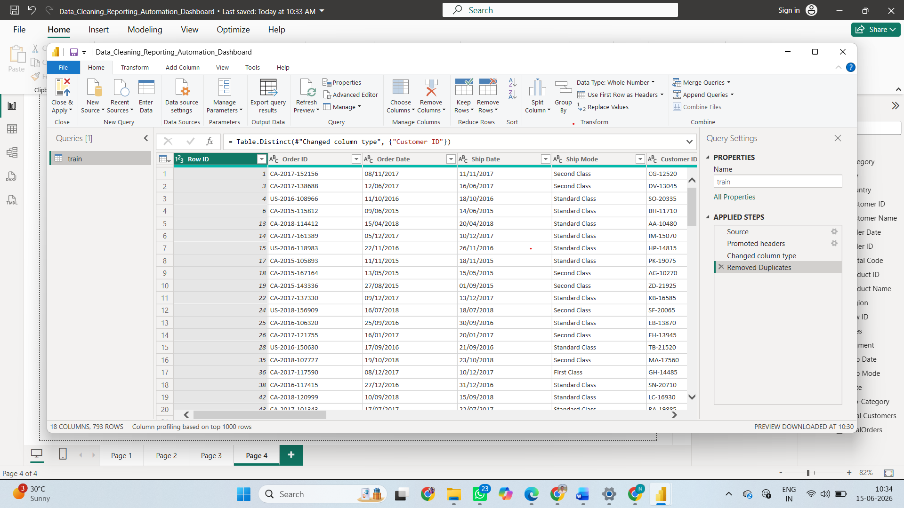

# 🧹 Data Cleaning & Reporting Automation Dashboard
Data Cleaning and Reporting Automation Dashboard built using Power BI. This project demonstrates data preprocessing, duplicate removal, automated reporting, and interactive visualizations for business insights.
## 📌 Project Overview

This project focuses on automating data cleaning and reporting processes using Power BI.

The dataset was cleaned using Power Query by removing duplicate records, handling inconsistencies, and preparing the data for analysis. Interactive dashboards were then created to generate meaningful business insights.

---

## 🎯 Objectives

- Remove duplicate records
- Clean and preprocess raw data
- Generate automated reports
- Create interactive dashboards
- Improve reporting efficiency

---

## 🛠 Tools Used

- Power BI
- Power Query
- DAX
- Excel / CSV Dataset

---

## 📊 Dashboard Features

### KPI Cards
- Total Customers
- Total Sales

### Visualizations
- Sales by Category
- Sales by Region
- Orders by Segment

### Filters
- Region Slicer

---

## 🧹 Data Cleaning Steps

1. Imported dataset into Power BI
2. Checked data quality
3. Removed duplicate records
4. Validated customer data
5. Applied transformations using Power Query
6. Loaded cleaned dataset for reporting

---

## 📈 Business Insights

- Technology category generated the highest sales.
- Consumer segment contributed the highest number of orders.
- Regional analysis provides sales distribution across locations.
- Automated reports help in faster decision making.

---

## 📂 Files Included

- Data_Cleaning_Reporting_Automation_Dashboard.pbix
- dashboard4.png
- train.csv
- README.md

---

## 📸 Dashboard Preview

---

## 🚀 Outcome

This project helped in understanding:

- Data Cleaning Techniques
- Power Query Transformations
- Reporting Automation
- Dashboard Development
- Business Intelligence Concepts

---

### Author

B. Satyanarayana
B.Tech AI & Data Science
St. Mary's Group of Institutions, Hyderabad
